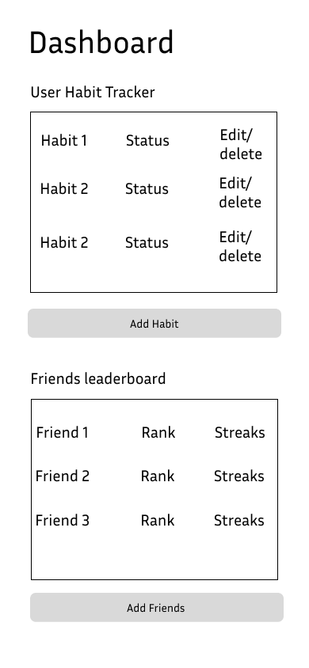

# Project Title

LevelUp

## Overview

LevelUp is an interactive and social habit tracker app that allows users to build and maintain healthy habits while staying motivated through social engagement. Users can track their progress, add friends, view each other’s achievements, and send motivational messages to create a supportive community.

### Problem Space

Building and maintaining habits is challenging, especially without external accountability. Many habit trackers focus only on individual progress, lacking social engagement to keep users motivated. People often give up on habits due to a lack of encouragement or friendly competition. LevelUp addresses this by combining habit tracking with community support, making self-improvement more engaging and fun.

### User Profile

**Primary Users:** Individuals looking to build and maintain habits, especially those who thrive on social accountability and gamification.

**Secondary Users:** Friends or family members of primary users who join to provide support or participate in challenges.

**Special Considerations:**
-Ensure an intuitive user experience to cater to a broad audience.
-Provide privacy options for users who may not want to share all habit data.
-Create engaging visuals and gamification elements to maintain user interest.

### Features

**User Accounts:**
-Sign up and log in to track personal habits and connect with friends.

**Habit Tracking:**
-Create, edit, and delete habits.
-Log daily/weekly completions and track streaks.

**Friends List:**
-Add friends by username or email.
-View friends' progress and streaks.

**Progress Sharing:**
-Display friends' streaks and points on the dashboard.
-Show personal and group leaderboards for friendly competition.

**Motivational Features:**
-Send and receive encouragement messages.
-Challenge friends to complete specific habits or milestones.

## Implementation

### Tech Stack

**Front-end:** React, Chart.js (for progress visualization).

**Back-end:** Node.js with Express.

**Database:** MySQL

**Authentication:** Node.js with Express

### APIs

-No external APIs required; all data is managed via the backend.

### Sitemap

Home Page/Landing:
-Links to sign up or log in.

Sign up/Sign in pages:
-Allows users to create an account or log in

Dashboard:
-Display user’s habits, streaks, and points.
-Show friends' progress and leaderboard.

Add/Edit Habit Page:
-Form to create or edit a habit.

Friends Page:
-Add or manage friends.
-View friends' streaks and motivational messages.

Profile Settings:
-Update user profile, privacy settings, and notification preferences.

### Mockups

### Data

Data Points:
User: { id, username, email, password, profilePicture, friendsList }

Habit: { id, userId, title, description, frequency, streakCount, completionHistory }

Friendship: { id, userId, friendId, status (pending/accepted) }

Encouragement Message: { id, senderId, recipientId, message, timestamp }

Relationships:
One user can have many habits.

One user can have many friends (many-to-many via Friendship table).

One user can send/receive many encouragement messages.

### Endpoints

**User Endpoints:**

POST /signup: Create a new user account.

POST /login: Authenticate user credentials.

GET /user/:id: Fetch user profile and friends list.

Habit Endpoints:

POST /habits: Create a new habit.

GET /habits: Fetch all habits for the logged-in user.

PATCH /habits/:id: Update a habit.

DELETE /habits/:id: Delete a habit.

**Friendship Endpoints:**

POST /friends: Send a friend request.

GET /friends: Fetch all friends for the logged-in user.

PATCH /friends/:id: Accept or decline a friend request.

**Encouragement Endpoints:**

POST /messages: Send an encouragement message.

GET /messages: Fetch received messages for the logged-in user.

## Roadmap

Week 1:

-Day 1-2: Finalize project structure, set up Authentication, and build backend endpoints.

-Day 3-4: Implement habit tracking functionality (CRUD operations and streak tracking).

-Day 5-6: Create frontend components for habit tracking and user dashboard.

Week 2:

-Day 7-8: Add friends feature (friend requests, viewing progress).

-Day 9-10: Implement motivational features (encouragement messages, leaderboards).

-Day 11-12: Gamify the app with points, badges, and challenges (if time permits)

-Day 13: Conduct testing, fix bugs, and refine UI/UX.

-Day 14: Prepare final presentation/demo

## Future Implementations
Gamification:
-Earn points for completing habits and encouraging friends.
-Unlock badges for streaks and milestones.

Optional Notifications:
-Reminders to log habits or encourage friends.

